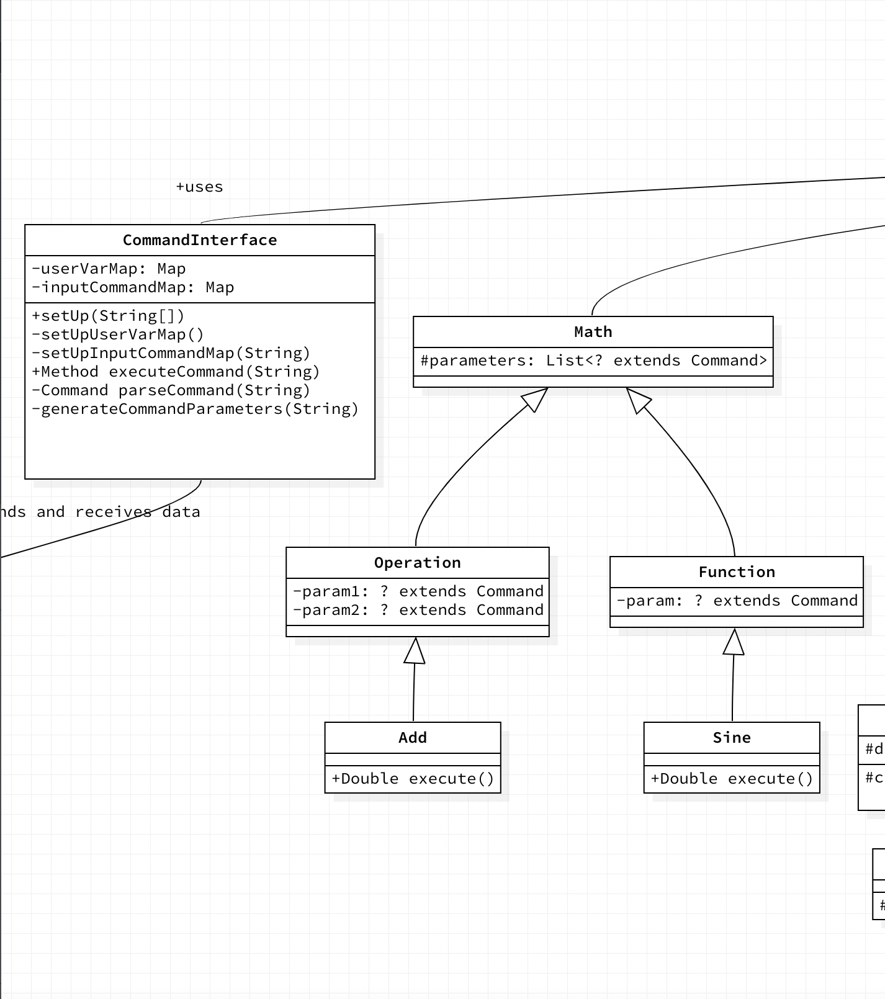
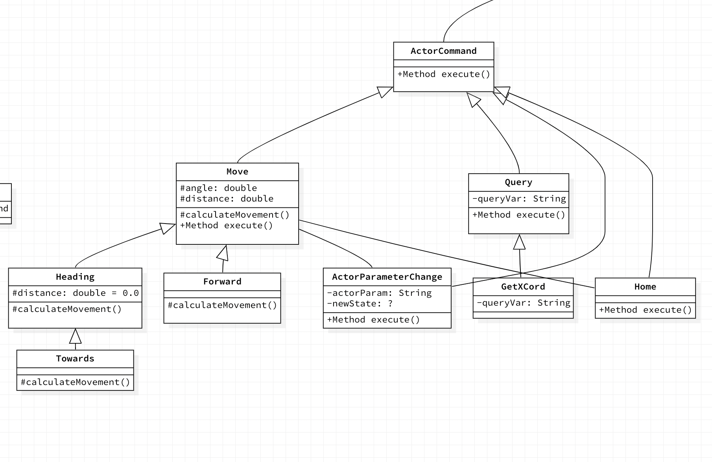
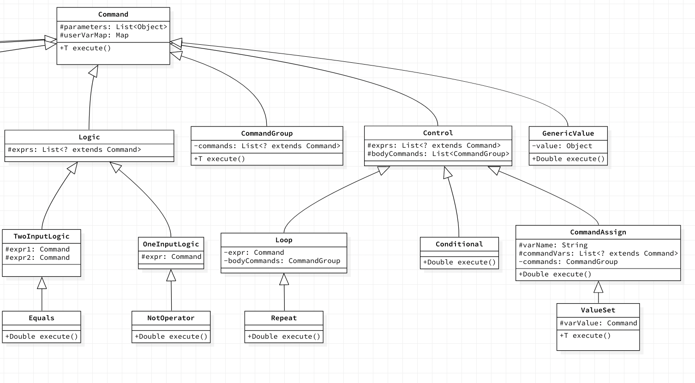

# SLogo Design Plan
### Luke, Luka, Ricky, Vincent
### Team 5

## Introduction
* Main goal: make an interactive, graphical, and kid-friendly Logo compiler
* Easy to add many turtles or other objects on screen
* Easy to add additional commands (different options like shapes, etc.)
* Theoretical support for languages besides Logo
* Flexible with user input (helpful error messages, correct/incorrect commands)
* Flexible for view (different background colors, different images for turtle, etc.)
* The specific way the turtle (or type of turtle) responds to commands is closed, but the turtle can be extended to add new options
* Project will be separated into Frontend (View), Parser, Model (what handles the turtle actions), and Controller

## Overview
* **Front End API**
    * External
        * The only interaction controler would need with the view is to be able to update it according the the information which was parsed from the user input.
    * Internal
        * Internal API would be used to help classes inside the View package to communicate. For example if major GUI variables(stylesheet, ResourceBundle) are changed, all GUI elements would need to be edited, all these communications would be done internally between classes in the view pacakge.
    * possible implementations include using different javaFX data structures for the view, like we could use either Group or Canvas objects for the TurtleScreen. Since the View package is so encapsulated usage of different data structures would not imact the API or other packages.
* **Command Parser API**
    * External
        * Method that returns a Command/Method given a String
    * Internal
        * Method converting String into Command object
        * Method that generates parameters for Command object given a String
    * Two Different Implementations
        * Map of Command name to parameters used
        * Annotations for "mapping" Command name to parameters
* **Model API**
  Manages the state of the world (turtles, lines drawn, and any other objects added later)
    * External
        * Has methods to take in commands and execute them, resulting actions taken are passed back to the caller
        * Provides access to different actors and the lines drawn
    * Internal
        * Actors have methods that are general to all actors (move, turn, etc), subclasses of Actor have methods specific to them (pen up, pen down)
    * Two Different Implementations
        * Actors are stored in an ArrayList and the lines drawn are stored as a ArrayList of arrays containing 2 points each
        * Actors are stored in an array that is resized whenever it is filled up. The lines drawn are stored as an ArrayList of Line objects

* **Controller API**
    * External
        * No public methods, the constructor will be only API
    * Internal
        * Method that tells simulation to update with String COMMAND_INFO as parameter
        * Methods for each type of button on the screen (pause, about, enter, etc)
        * Methods to handle exception methods
    * Two Different Implementations
        * CSS files to handle fonts, sizes, colors, etc for error methods
        * Properties files to facilitate messages

* UML Diagram for Command API
  * 
  * 
  * 
## User Interface
![This is cool, too bad you can't see it] ()
* `CommandInputBox`: this class accepts user text input, maybe a button to load input from an external file.
* `UserFunctionsView`: Displays user defined functions(commands) if any exist.
* `VariableView`: Displays user defined variables, if any exist.
* `CommandBoxHisotry`: Displays the history of user inputs, scrollable.
* `TurtleScreen`: biggest component of the UI, the main "canvas" which visualizes the turtle movement.
* `ToolBar`: At the top of the window, has commands to change canvas color, background color, turtle design, language, the "Info" screen.
* `ErrorDisplay`: pop up window which displayes an error which it is fed.
*  `MainView`: includes the main root for the scene, arranges all of the above elements into the root. Manages some main and high-level GUI interactions.

Some errors include incorrect commands, or wrong syntax, all of this will be handled in Controller, but we will have a `ErrorDisplay.java` class which displays a pop-up error window with a message when needed.
## Design Details
* **Front End**
    * `MainView.java`
        * has all the GUI element nodes, manages the primary stage of the application.
    * `TurtleScreen.java`
        * has `GraphicalTurtle.java`.
    * `ToolBar.java` has:
        *  `CanvasColorSelector`
        *  `BackgroundColorSelector`
        *  `TurtleDesignSelector`
        *  `PenColorSelector`
        *  `InfoDisplayWindow`
    * `VariableView.java`
    * `UserFunctionsView.java`
    * `CommandInputBox.java`
    * `CommandBoxHistory.java`
* **Command Parser**
    * Command interface/parser class
        * Takes Strings given by Controller and returns Command objects
        * Offloads responsibilities from Controller to a separate class inkeeping with SRP
    * Command class
        * Abstract class with many subclasses for each possible Command
        * Contains an execute() method that is used by Controller/Model to execute a method
        * Extendable: new commands can be added simply by adding a subclass
        *
* **Model**
    * Model class
        * Takes Command objects, executes them, and returns a list of actions (at this point just movements) that say each thing the turtle did along with anything to print
        * Separate to World so that it can potentially store a history of World states if we need it later
    * World class
        * Has methods to provide access to all the Actors (similarly to how a list works)
        * Has methods to provide access to the lines that have been drawn
        * Used to contain all the details of the world state, separate to the functionality of the base model class
    * Actor class
        * Has methods common to all actors (move, turn, etc..)
        * Allows for actors that aren't just the turtle we're told about
    * Turtle class
        * Has methods to control behavior specific to the turtle (pen up, pen down)
    * MoveInfo class
        * Contains data for which turtle moved, what position it moved from and to, whether the pen was up or down, and a message to print if there is one
        * Completely made of getters and setters
* **Controller**
    * Controller main class
        * Takes the command object returned by the Command Parser and passes the information
          to the model
        * Passes the information (turtle movement, math operation, etc) calculated in the model to the view
        * handles button input like pause, speed, etc
    * Logo Saver
        * Saves both the image produced (as a jpg maybe) as well as he the list of commands that led to that Logo (likely in a text file)
    * Logo Loader
        * Loads the text file that holds all the commands to create that image. The logo would be loaded in, and the turtle's last state in the loaded file will be the current state.

## Design Considerations
* How does Command act on actors?
    * Alternative 1: returns Method object passed to Actor
        * Pros: More lightweight because most Methods do not use the World (e.g. Math)
        * Cons: Managing different return types is annoying
        * This assumes only the Actor will ever utilize methods, which may not be true and can complicate things later
    * Alternative 2: World given as parameter to each Command and Command uses it as necessary
        * Pros: Easier to implement and extendable to multiple worlds
        * Cons: Some commands don't need world
    * Alternative 2 chosen because its pros outweigh the pros of Alternative 1

* How should the model and view interact?
    * Alternative 1: Model passes view a command to execute upon the Actor Node's information
        * Pros: The model would not worry about exactly what information needs to be passed, would simplify Back-end
        * Cons: The view would have to concern itself with calculations, albeit simple ones, which violates the SRP a bit
    * Alternative 2: Model calculates all changes in state of the turtle and passes prepared data representing those changes (as a MoveInfo object) to the view
        * Pros: The model would handle all things calculation and simply pass a state of the turtle. This would allow for other types of views to be utilized (like an app, maybe)
        * Cons: Different commands will return different information, so making a standard pass from Model to View will be more difficult
    * Alternative 3: The Model does all calculations in changing the state of the World, then returns the entire world state after each command
        * Pros: The model handles all calculations and simply returns states. The view has access to all the data available for whatever it wants to use it for.
        * Cons: The view has access to information it doesn't need and possibly shouldn't know about. It is responsible for figuring out what has changed between all of the many possible things to check.
    * Alternative 2 chosen as we value the SRP more than convenience and want to simplify what the view has to handle

## Test Plan
* Code is testable
    * Specific error messages
        * Only Controller catches errors, everything else throws
    * Segmentation into separate APIs that interface only with Controller
        * Easy to see which API has errors
* Syntax
    * Correct syntax for commands (especially loops and conditionals)
        * Positive testing
        * Correct turtle movement should be displayed on screen
        * Methods tested: parseCommand, updateTurtle
    * Incorrect syntax entered (missing parameters, mispellings)
        * Negative testing
        * Correct error popup displayed on screen
        * Methods tested: parseCommand
* Different languages/configuration files
    * Unknown file or corrupted file should show error
        * Negative testing
        * Correct error should popup on screen
        * Method tested: loadFiles
    * Visual text should be correct language/colors should be from css file
        * Positive testing
        * Correct text/colors should be shown on screen
        * Method tested: setUpScene()
* Changing view parameters (animation speed, play, pause, etc.)
    * Visual feedback should reflect button pressed
        * Positive testing
        * Turtle should react appropriately to button (e.g. stop when pause, move faster when sped up)
        * Method tested: buttonHandler, viewUpdate
* Logic
    * Check loops
        * Positive testing
        * Correct for loops that should terminate
        * methods tested: any method that can be iterated (mainly updateActor)
    * Check conditionals
        * Negative testing
        * An infinite loop should time out and return an error message
        * methods tested: any method that can be iterated (mainly updateActor)
* Saving user variables
    * Input and run user variables/commands
        * Positive testing
        * No Unknown Variable errors should pop up
        * Code should run correctly as if a value/list of commands were provided instead of a variable
    * Mispell user variable
        * Negative testing
        * Unknown Variable error popup

## Team Responsibilities

* Luka
    * Primary: UI

* Luke
    * Primary: Controller

* Ricky
    * Primary: Model and Parser

* Vincent
    * Primary: Commands and Parser
